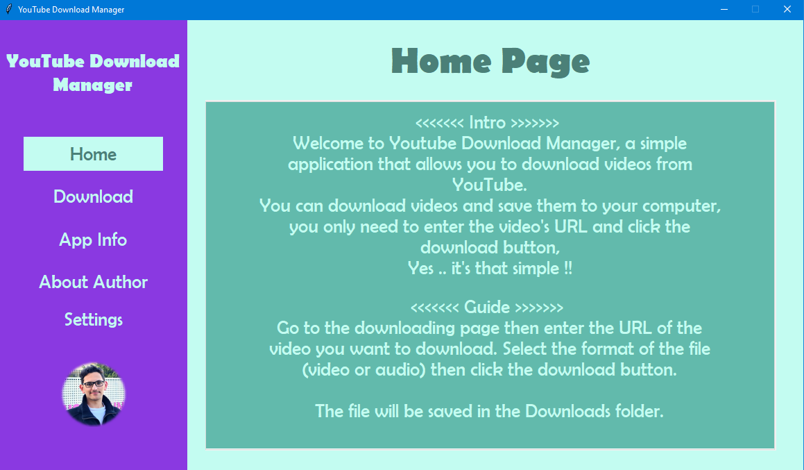
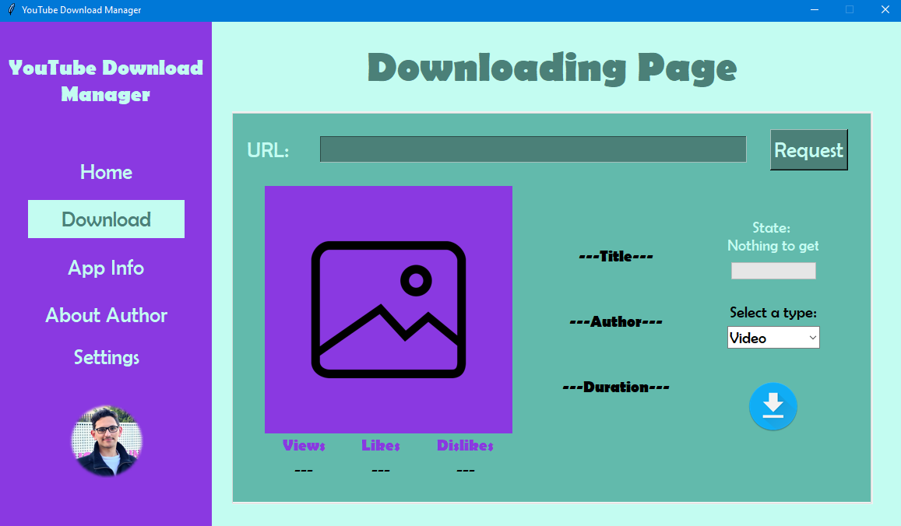
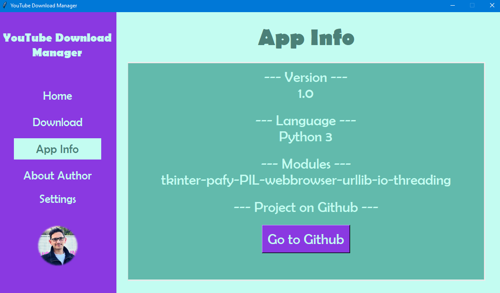
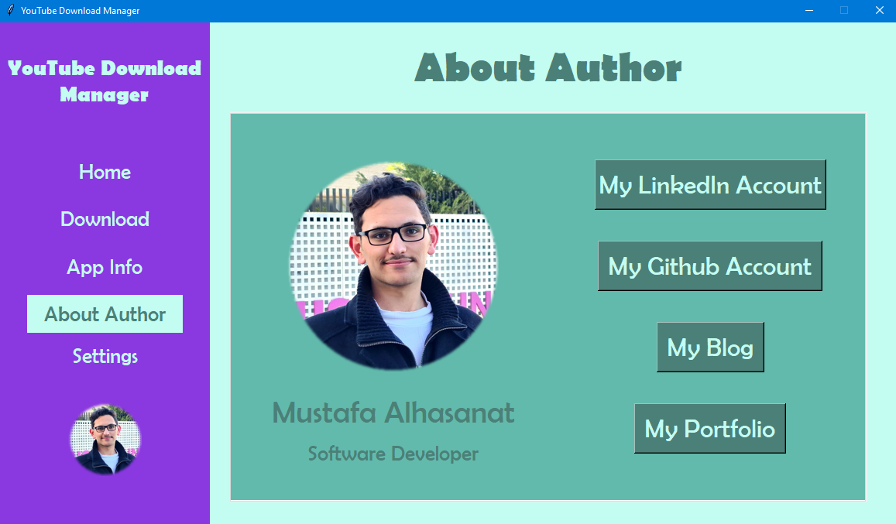
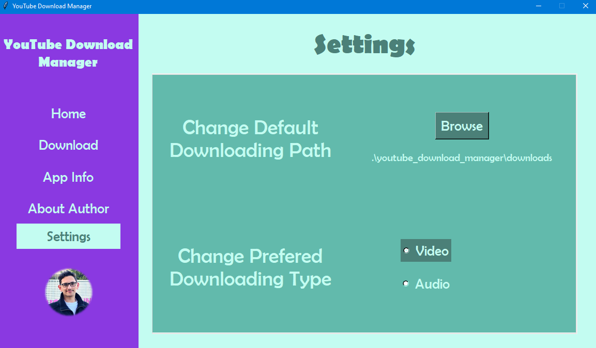
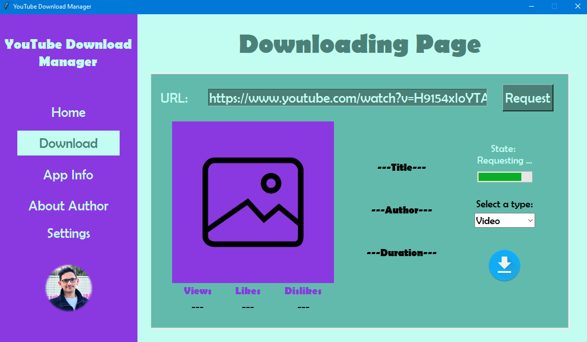
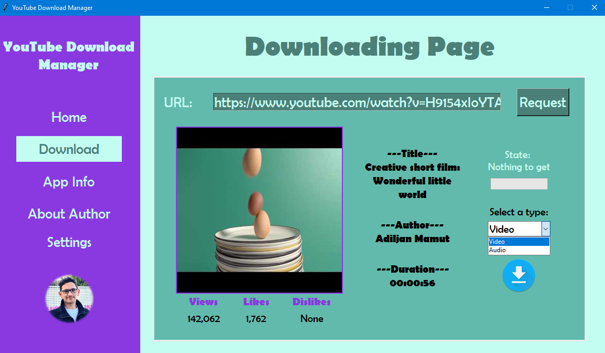
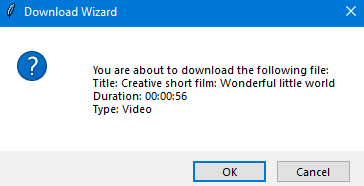
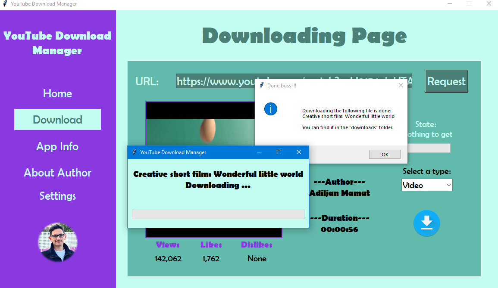
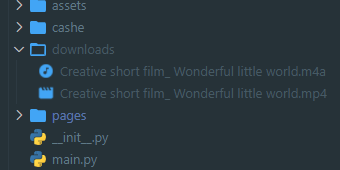

# Youtube Download Manager

It is a GUI tool that allows you to download any video from Youtube in an (mp4) format as a video or an (mp3) format as an audio.

---

## Discovering the app

You can navigate through the pages by the buttons on the left side of the main page:

- The Home page: it has an intro to the program and a simple guide

- The Download page: from here we can download files 

- App info page: it has some info about the modules that have been used and a button that brings you here to this Github page: 

- About author page: it has some buttons thatguides you to my social accounts, portfolio website, and personal tech blog: 

- The Setting page: you can change the default path to save your downloaded files, you can also change the default file type you use usualy: 

    (don't worry, your prefered settings will be saved even if you closed the app)

---
---

## How to use the app

- Open the program, you are going to see the home page:

- Go to the Download page, you are going to see some default placeholders for the labels and the image:

- Copy the URL of the video from Youtube and paste it in the top field, then click on the Request button, you will see something like this:

- After the image has changed, we know that the requesting is done, now we have to select rather if we want to download that file as a video or audio from the spinning box on the right:

- Now we can click on the download button on the right bottom corner, it will ask you to confirm the data on the desired file:

- After confirming, a download wizard that have the title of the video and a progress bar will be opened, then the file will start downloading:

- After the download is done, we can find it in the default folder (downloads):

---

## Implementation

- This app had taken 4 days to finish it (arround 20 hours in total)

- It has arround 1100 lines of pure python code

---
